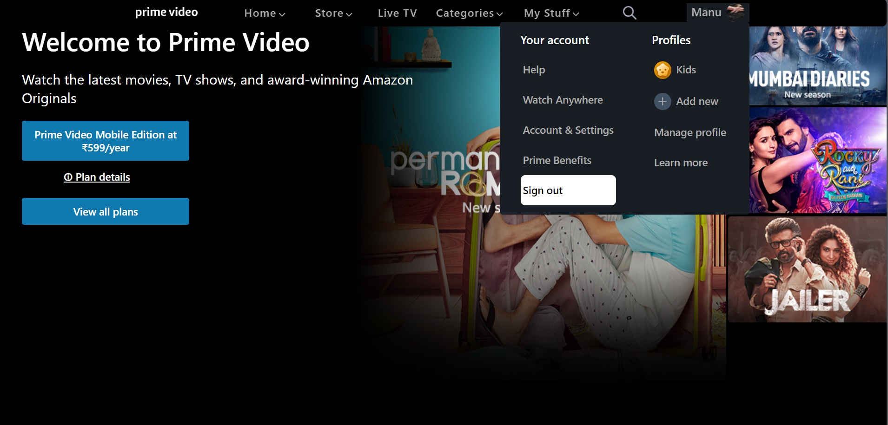
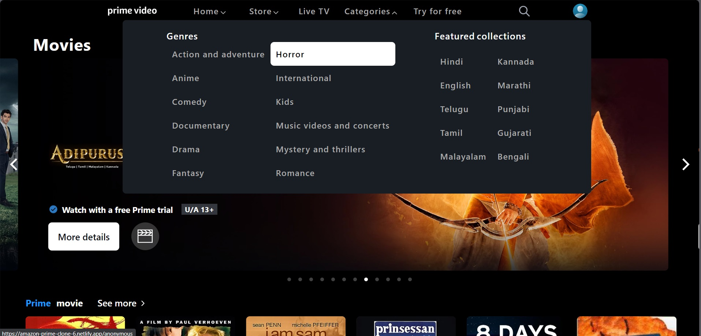
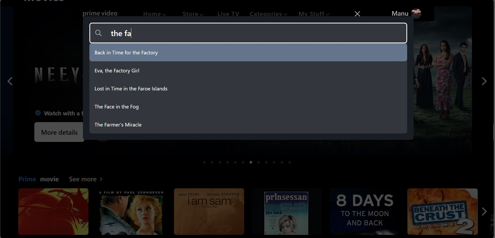
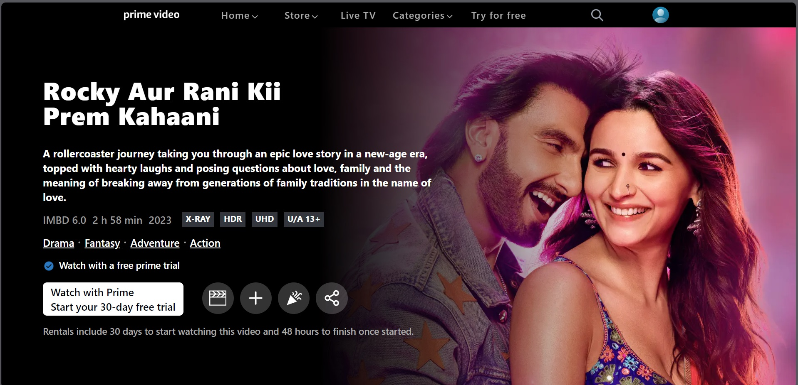
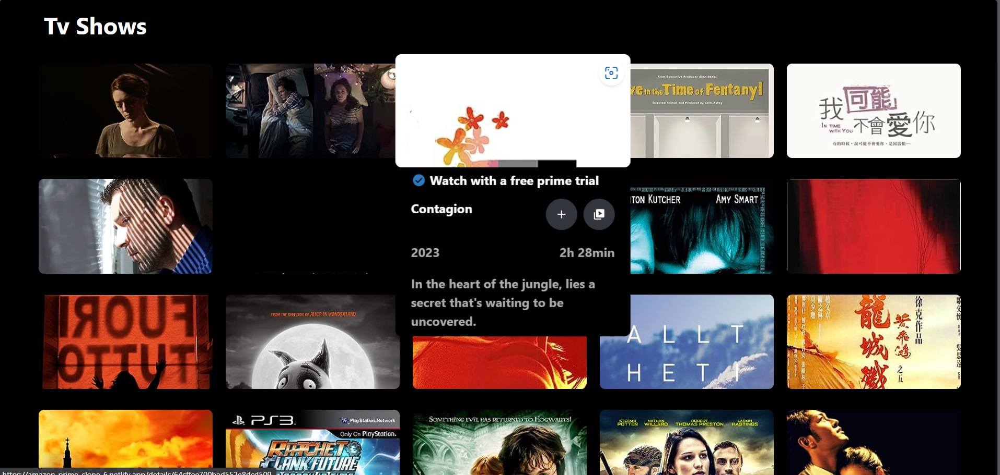

# Amazon Prime Video Clone

This project aims to create a functional clone of the Amazon Prime Video website, providing users with a similar experience to explore, stream, and enjoy a vast library of movies, TV shows, and original content online.

## Demo

Explore the live demo of the Amazon Prime Video clone:https://amazon-prime-clone-6.netlify.app/
This demo provides a hands-on experience of the features and functionalities implemented in the MakeMyTrip clone. Feel free to interact with the application and test its capabilities.

## Tech Stack

**React:** A JavaScript library for building user interfaces

**HTML:** Markup language for structuring web content

**CSS:** Style sheet language for presenting web content

**Javascript:** High-level programming language for scripting in web development

**Tailwind CSS:** Enhance the styling process using Tailwind CSS for rapid development and easy customization of styles.

## Run Locally

Clone the project

```bash
  https://amazon-prime-clone-6.netlify.app/
```

Go to the project directory

```bash
  cd my-project
```

Install dependencies

```bash
  npm create vite@latest
```

Start the server

```bash
  npm run dev
```

# Features

### General Project Hygiene

    Version Control:
       - The project code is hosted on GitHub.

    Deployment:
        - The project is deployed and accessible online at your-deployment-link.
        - The deployment link is added to the GitHub profile.

    Documentation:
        - Well-documented project with clear explanations of structure, functionality, and technologies used.
        - Detailed README provides instructions on local setup and navigation.

### User Experience and Design

    Styling:
        - UI components are meticulously styled using CSS and Material-UI.
        - Subtle animations enhance the overall user experience.

    Dynamic UI:
        - The website offers dynamic interactions with smooth updates.

### Technical Functionalities

    No Dead-clicks:
       - Every tab or clickable item is responsive, eliminating dead clicks.

    Proper Navigation:
        - Tabs and links navigate users to appropriate destinations, with "Coming Soon" messages for upcoming features.

### Authentication

    Login Functionality and Validations:
       - User-friendly login form with input fields.
       - Client-side validation for password length, date of birth, and email format.

    Protected Routes:
       - Implementation of protected routes ensuring authenticated user access.

    Error Handling:
       - Clear error messages during unsuccessful login attempts.

    Sensible Error Messages:
       - Ensures error messages do not disclose sensitive information.

    Remember User on Subsequent Logins:
       - "Remember Me" functionality improves user convenience.

    Display User Profile Details:
       - User's profile details displayed after successful login.

    Logout Feature:
       - User-friendly logout functionality.

### Data Manipulation

    Data Storage and Transfer:
       - Effective use of React state and props for seamless data management.

    Dynamic Updates:
       - Live interactions for dynamic updates are properly implemented.

### Deployment and Infrastructure

    Asynchronous Data/API Interactions:
       - Proper handling of asynchronous data interactions.

    Demonstrating Deployment & Infrastructure:
        - The project is deployed and hosted on Netlify/Heroku/Vercel.

    Managing Versions on GitHub:
       - Regular commits, meaningful commit messages, and organized branching and merging.

### Code Quality

    Code Organization:
       - Well-organized codebase into modular components.

    Naming Conventions:
       - Consistent and meaningful naming conventions.

    Avoiding Code Duplication:
      - Reduction of redundancy through code refactoring.

    Code Readability:
       - Clean and readable code with proper indentation and formatting.

    Error Handling:
       - Robust error handling throughout the application.

    Code Performance:
       - Consideration of performance implications and optimization where necessary.

## Optimizations

#### Performance Optimization:

    To ensure optimal performance, I focus on minimizing unnecessary re-renders and using resources efficiently.

    Lazy Loading of Assets
        I implement lazy loading of assets to defer the loading of non-critical resources until they are needed. This approach speeds up the initial page load time.

## Screenshots







### Lessons Learned

#### 1. Technology Stack Evaluation:

Reflecting on the technology stack choices for the Amazon Prime Video clone project, we found that the combination of HTML, CSS, JavaScript, React, and Tailwind CSS provided a robust foundation. The strengths included rapid development with React and streamlined styling using Tailwind CSS. However, constant updates and staying aligned with the latest technologies proved essential for optimal development.

#### 2. Project Scope and Planning:

The initial project scope and planning were crucial in setting the roadmap for development. Challenges arose in managing evolving requirements and timelines. Regular reviews and adjustments to the project roadmap helped in adapting to changing priorities, ensuring a more flexible and responsive development process.

#### 3. User Experience Design:

User experience design played a pivotal role in creating an intuitive interface for the Amazon Prime Video clone. Feedback from testing and iterations highlighted the importance of simplicity and ease of navigation. Iterative design processes ensured continuous improvement, contributing significantly to the overall usability of the application.

#### 4. Performance Optimization Challenges:

Optimizing performance presented challenges, with unexpected bottlenecks emerging during intensive streaming scenarios. Implementing efficient data caching and optimizing rendering processes helped address these challenges. Continuous monitoring and periodic optimization remain integral for providing a seamless streaming experience.

#### 5. Git and Version Control:

Git and version control were instrumental in collaborative development. Effective branching and merging strategies facilitated parallel development, but challenges surfaced in resolving conflicts. Maintaining a clean version history required disciplined commit practices. Emphasizing code reviews and clear communication streamlined the version control process.

#### 6. Feature Development and Prioritization:

Feature development involved meticulous prioritization to align with user expectations. Managing dependencies and ensuring a coherent user experience required careful planning. Iterative development cycles and regular user feedback proved invaluable in refining features and maintaining a user-centric approach.

#### 7. User Authentication and Security:

Implementing robust user authentication and security measures demanded careful consideration. Challenges in ensuring user data privacy were met through encryption and secure authentication practices. Constant vigilance and staying informed about security best practices remain crucial for safeguarding user information.

#### 8. Conclusion and Acknowledgments:

In conclusion, this project provided invaluable insights into the complexities of creating a streaming platform. Acknowledgment goes to all contributors and mentors for their support. Successes and challenges alike have been instrumental in our ongoing learning journey. Gratitude extends to everyone involved in making this project a valuable experience.

## FAQ

### 1. What is the Amazon Prime Video Clone?

The Amazon Prime Video Clone is a replication of the Amazon Prime Video streaming platform. It aims to provide users with a similar streaming experience, allowing them to browse, watch, and enjoy a wide range of movies, TV shows, and exclusive content.

### 2. Is this project an exact replica of Amazon Prime Video?

No, our project is not intended to be an exact clone. While it emulates the core functionalities of Amazon Prime Video, our goal is to enhance the user experience and address specific needs, incorporating unique features and improvements.

### 3. What technologies are used in this project?

The project is built using HTML, CSS, JavaScript, and React for the frontend. The backend utilizes Node.js with Express, and MongoDB is used as the database. Refer to the Tech Stack section for more details.

### 4. How can I run the project locally?

To run the project locally, follow the steps outlined in the Run Locally section of this README.

### 5. Are there any known issues or limitations?

Check the Issues page on GitHub for a list of known issues and current project limitations.

### 6. How do I report a bug or suggest a new feature?

You can report bugs or suggest new features by opening an issue on the Issues page.

### 7. Is there a live demo available?

Yes, you can find the live demo of the Amazon Prime Video Clone at Demo Link. Visit the demo to explore the project's features and streaming capabilities.
